# [📈 Live Status](https://RedGeckoAgency.github.io/multisite-uptime): <!--live status--> **🟧 Partial outage**

This repository contains the open-source uptime monitor and status page for [RedGeckoAgency](https://redgeckoagency.com/), powered by [Upptime](https://github.com/upptime/upptime).

With [Upptime](https://upptime.js.org), you can get your own unlimited and free uptime monitor and status page, powered entirely by a GitHub repository. We use [Issues](https://github.com/RedGeckoAgency/multisite-uptime/issues) as incident reports, [Actions](https://github.com/RedGeckoAgency/multisite-uptime/actions) as uptime monitors, and [Pages](https://RedGeckoAgency.github.io/multisite-uptime) for the status page.

<!--start: status pages-->
<!-- This summary is generated by Upptime (https://github.com/upptime/upptime) -->
<!-- Do not edit this manually, your changes will be overwritten -->
<!-- prettier-ignore -->
| URL | Status | History | Response Time | Uptime |
| --- | ------ | ------- | ------------- | ------ |
|  [Arlington Care](https://arlington-care.net) | 🟥 Down | [arlington-care.yml](https://github.com/RedGeckoAgency/multisite-uptime/commits/HEAD/history/arlington-care.yml) | 

 713ms
     
 | 

<a href="https://RedGeckoAgency.github.io/multisite-uptime/history/arlington-care">99.65%</a>
    

|  [Austin Trace](https://austin-trace.net) | 🟥 Down | [austin-trace.yml](https://github.com/RedGeckoAgency/multisite-uptime/commits/HEAD/history/austin-trace.yml) | 

 505ms
     
 | 

<a href="https://RedGeckoAgency.github.io/multisite-uptime/history/austin-trace">99.66%</a>
    

|  [Bennington Glen](https://bennington-glen.net) | 🟥 Down | [bennington-glen.yml](https://github.com/RedGeckoAgency/multisite-uptime/commits/HEAD/history/bennington-glen.yml) | 

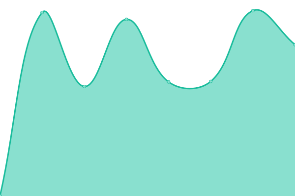 733ms
     
 | 

<a href="https://RedGeckoAgency.github.io/multisite-uptime/history/bennington-glen">99.66%</a>
    

|  [Capri Gardens](https://capri-gardens.net) | 🟥 Down | [capri-gardens.yml](https://github.com/RedGeckoAgency/multisite-uptime/commits/HEAD/history/capri-gardens.yml) | 

 768ms
     
 | 

<a href="https://RedGeckoAgency.github.io/multisite-uptime/history/capri-gardens">99.67%</a>
    

|  [Countryview Sunbury](https://countryview-sunbury.net) | 🟥 Down | [countryview-sunbury.yml](https://github.com/RedGeckoAgency/multisite-uptime/commits/HEAD/history/countryview-sunbury.yml) | 

 859ms
     
 | 

<a href="https://RedGeckoAgency.github.io/multisite-uptime/history/countryview-sunbury">99.68%</a>
    

|  [Crown Pointe](https://crown-pointe.net) | 🟥 Down | [crown-pointe.yml](https://github.com/RedGeckoAgency/multisite-uptime/commits/HEAD/history/crown-pointe.yml) | 

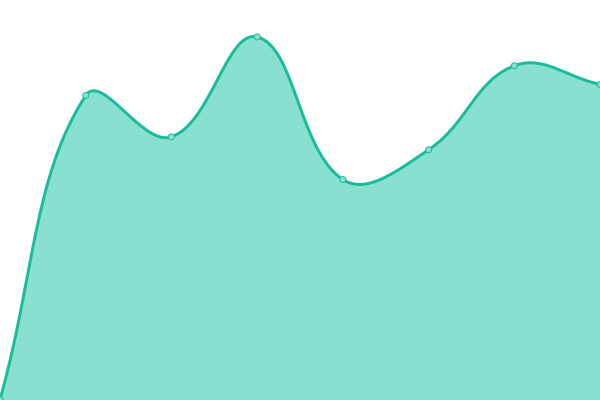 804ms
     
 | 

<a href="https://RedGeckoAgency.github.io/multisite-uptime/history/crown-pointe">99.68%</a>
    

|  [Darby Glenn](https://darby-glenn.net) | 🟥 Down | [darby-glenn.yml](https://github.com/RedGeckoAgency/multisite-uptime/commits/HEAD/history/darby-glenn.yml) | 

 862ms
     
 | 

<a href="https://RedGeckoAgency.github.io/multisite-uptime/history/darby-glenn">99.68%</a>
    

|  [Gables Marysville](https://gables-marysville.net) | 🟥 Down | [gables-marysville.yml](https://github.com/RedGeckoAgency/multisite-uptime/commits/HEAD/history/gables-marysville.yml) | 

 792ms
     
 | 

<a href="https://RedGeckoAgency.github.io/multisite-uptime/history/gables-marysville">99.69%</a>
    

|  [Glen Meadows](https://glen-meadows.net) | 🟥 Down | [glen-meadows.yml](https://github.com/RedGeckoAgency/multisite-uptime/commits/HEAD/history/glen-meadows.yml) | 

 684ms
     
 | 

<a href="https://RedGeckoAgency.github.io/multisite-uptime/history/glen-meadows">99.69%</a>
    

|  [Meadows Marion](https://meadows-marion.net) | 🟥 Down | [meadows-marion.yml](https://github.com/RedGeckoAgency/multisite-uptime/commits/HEAD/history/meadows-marion.yml) | 

 678ms
     
 | 

<a href="https://RedGeckoAgency.github.io/multisite-uptime/history/meadows-marion">99.70%</a>
    

|  [Johnstown Pointe](https://johnstown-pointe.net) | 🟥 Down | [johnstown-pointe.yml](https://github.com/RedGeckoAgency/multisite-uptime/commits/HEAD/history/johnstown-pointe.yml) | 

 877ms
     
 | 

<a href="https://RedGeckoAgency.github.io/multisite-uptime/history/johnstown-pointe">99.70%</a>
    

|  [Landingsofwesterville](https://landingsofwesterville.net) | 🟥 Down | [landingsofwesterville.yml](https://github.com/RedGeckoAgency/multisite-uptime/commits/HEAD/history/landingsofwesterville.yml) | 

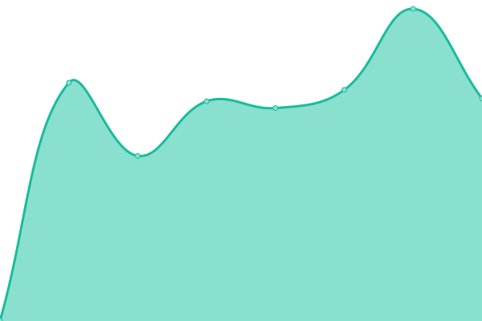 787ms
     
 | 

<a href="https://RedGeckoAgency.github.io/multisite-uptime/history/landingsofwesterville">99.71%</a>
    

|  [Maria Joseph](https://maria-joseph.net) | 🟥 Down | [maria-joseph.yml](https://github.com/RedGeckoAgency/multisite-uptime/commits/HEAD/history/maria-joseph.yml) | 

 718ms
     
 | 

<a href="https://RedGeckoAgency.github.io/multisite-uptime/history/maria-joseph">99.72%</a>
    

|  [Mcnaughten Pointe](https://mcnaughten-pointe.net) | 🟥 Down | [mcnaughten-pointe.yml](https://github.com/RedGeckoAgency/multisite-uptime/commits/HEAD/history/mcnaughten-pointe.yml) | 

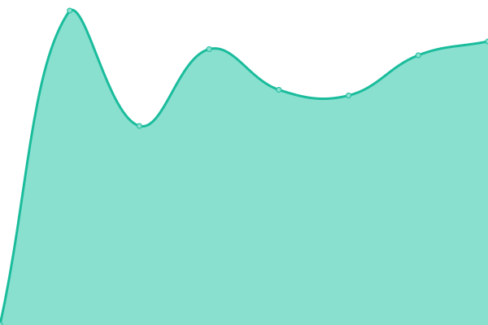 783ms
     
 | 

<a href="https://RedGeckoAgency.github.io/multisite-uptime/history/mcnaughten-pointe">99.72%</a>
    

|  [Meadow Grove](https://meadow-grove.net) | 🟥 Down | [meadow-grove.yml](https://github.com/RedGeckoAgency/multisite-uptime/commits/HEAD/history/meadow-grove.yml) | 

 835ms
     
 | 

<a href="https://RedGeckoAgency.github.io/multisite-uptime/history/meadow-grove">99.73%</a>
    

|  [Taylors Pointe](https://taylors-pointe.net) | 🟥 Down | [taylors-pointe.yml](https://github.com/RedGeckoAgency/multisite-uptime/commits/HEAD/history/taylors-pointe.yml) | 

 863ms
     
 | 

<a href="https://RedGeckoAgency.github.io/multisite-uptime/history/taylors-pointe">99.73%</a>
    

|  [Terrace View](https://terrace-view.net) | 🟥 Down | [terrace-view.yml](https://github.com/RedGeckoAgency/multisite-uptime/commits/HEAD/history/terrace-view.yml) | 

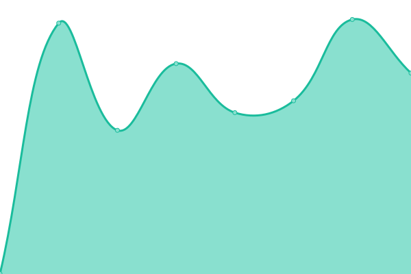 883ms
     
 | 

<a href="https://RedGeckoAgency.github.io/multisite-uptime/history/terrace-view">99.74%</a>
    

|  [Trueman Pointe](https://trueman-pointe.net) | 🟥 Down | [trueman-pointe.yml](https://github.com/RedGeckoAgency/multisite-uptime/commits/HEAD/history/trueman-pointe.yml) | 

 766ms
     
 | 

<a href="https://RedGeckoAgency.github.io/multisite-uptime/history/trueman-pointe">99.74%</a>
    

|  [Tuscany Gardens](https://tuscany-gardens.net) | 🟥 Down | [tuscany-gardens.yml](https://github.com/RedGeckoAgency/multisite-uptime/commits/HEAD/history/tuscany-gardens.yml) | 

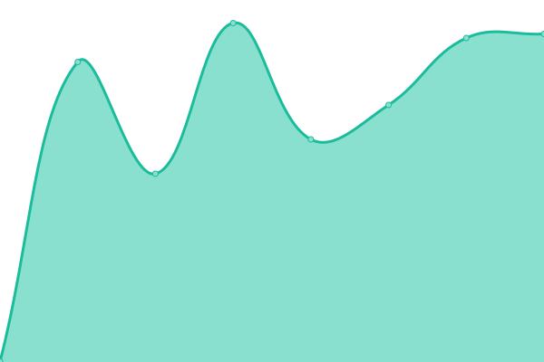 944ms
     
 | 

<a href="https://RedGeckoAgency.github.io/multisite-uptime/history/tuscany-gardens">99.75%</a>
    

|  [Verandagardens](https://verandagardens.net) | 🟥 Down | [verandagardens.yml](https://github.com/RedGeckoAgency/multisite-uptime/commits/HEAD/history/verandagardens.yml) | 

 833ms
     
 | 

<a href="https://RedGeckoAgency.github.io/multisite-uptime/history/verandagardens">99.75%</a>
    

|  [Admirals Pointe](https://admirals-pointe.net) | 🟥 Down | [admirals-pointe.yml](https://github.com/RedGeckoAgency/multisite-uptime/commits/HEAD/history/admirals-pointe.yml) | 

 422ms
     
 | 

<a href="https://RedGeckoAgency.github.io/multisite-uptime/history/admirals-pointe">98.06%</a>
    

|  [Batavia Care](https://batavia-care.net) | 🟥 Down | [batavia-care.yml](https://github.com/RedGeckoAgency/multisite-uptime/commits/HEAD/history/batavia-care.yml) | 

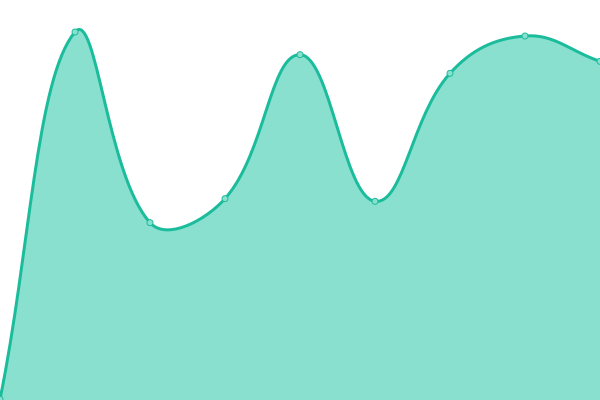 427ms
     
 | 

<a href="https://RedGeckoAgency.github.io/multisite-uptime/history/batavia-care">98.09%</a>
    

|  [Brunswick Pointe](https://brunswick-pointe.net) | 🟥 Down | [brunswick-pointe.yml](https://github.com/RedGeckoAgency/multisite-uptime/commits/HEAD/history/brunswick-pointe.yml) | 

 423ms
     
 | 

<a href="https://RedGeckoAgency.github.io/multisite-uptime/history/brunswick-pointe">98.11%</a>
    

|  [Dayton Respiratory](https://dayton-respiratory.net) | 🟥 Down | [dayton-respiratory.yml](https://github.com/RedGeckoAgency/multisite-uptime/commits/HEAD/history/dayton-respiratory.yml) | 

 853ms
     
 | 

<a href="https://RedGeckoAgency.github.io/multisite-uptime/history/dayton-respiratory">99.77%</a>
    

|  [Glenn Crossing](https://glenn-crossing.net) | 🟥 Down | [glenn-crossing.yml](https://github.com/RedGeckoAgency/multisite-uptime/commits/HEAD/history/glenn-crossing.yml) | 

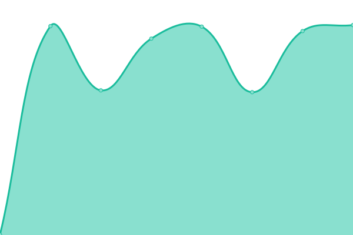 682ms
     
 | 

<a href="https://RedGeckoAgency.github.io/multisite-uptime/history/glenn-crossing">99.77%</a>
    

|  [Goldenyears Care](https://goldenyears-care.net) | 🟥 Down | [goldenyears-care.yml](https://github.com/RedGeckoAgency/multisite-uptime/commits/HEAD/history/goldenyears-care.yml) | 

 700ms
     
 | 

<a href="https://RedGeckoAgency.github.io/multisite-uptime/history/goldenyears-care">99.78%</a>
    

|  [Hearthstone Care](https://hearthstone-care.net) | 🟥 Down | [hearthstone-care.yml](https://github.com/RedGeckoAgency/multisite-uptime/commits/HEAD/history/hearthstone-care.yml) | 

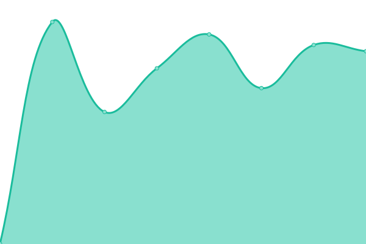 647ms
     
 | 

<a href="https://RedGeckoAgency.github.io/multisite-uptime/history/hearthstone-care">99.78%</a>
    

|  [Highbanks Care](https://highbanks-care.net) | 🟥 Down | [highbanks-care.yml](https://github.com/RedGeckoAgency/multisite-uptime/commits/HEAD/history/highbanks-care.yml) | 

 676ms
     
 | 

<a href="https://RedGeckoAgency.github.io/multisite-uptime/history/highbanks-care">99.79%</a>
    

|  [Inniswood](https://inniswood.net) | 🟥 Down | [inniswood.yml](https://github.com/RedGeckoAgency/multisite-uptime/commits/HEAD/history/inniswood.yml) | 

 771ms
     
 | 

<a href="https://RedGeckoAgency.github.io/multisite-uptime/history/inniswood">99.79%</a>
    

|  [Overbrook Landing](https://overbrook-landing.net) | 🟥 Down | [overbrook-landing.yml](https://github.com/RedGeckoAgency/multisite-uptime/commits/HEAD/history/overbrook-landing.yml) | 

 621ms
     
 | 

<a href="https://RedGeckoAgency.github.io/multisite-uptime/history/overbrook-landing">99.80%</a>
    

|  [Canterbury Villa](https://canterbury-villa.net) | 🟥 Down | [canterbury-villa.yml](https://github.com/RedGeckoAgency/multisite-uptime/commits/HEAD/history/canterbury-villa.yml) | 

 508ms
     
 | 

<a href="https://RedGeckoAgency.github.io/multisite-uptime/history/canterbury-villa">98.17%</a>
    

|  [Carington Park](https://carington-park.net) | 🟥 Down | [carington-park.yml](https://github.com/RedGeckoAgency/multisite-uptime/commits/HEAD/history/carington-park.yml) | 

 386ms
     
 | 

<a href="https://RedGeckoAgency.github.io/multisite-uptime/history/carington-park">98.20%</a>
    

|  [Champion Creek](https://champion-creek.net) | 🟥 Down | [champion-creek.yml](https://github.com/RedGeckoAgency/multisite-uptime/commits/HEAD/history/champion-creek.yml) | 

 545ms
     
 | 

<a href="https://RedGeckoAgency.github.io/multisite-uptime/history/champion-creek">98.66%</a>
    

|  [Claymont Health](https://claymont-health.net) | 🟥 Down | [claymont-health.yml](https://github.com/RedGeckoAgency/multisite-uptime/commits/HEAD/history/claymont-health.yml) | 

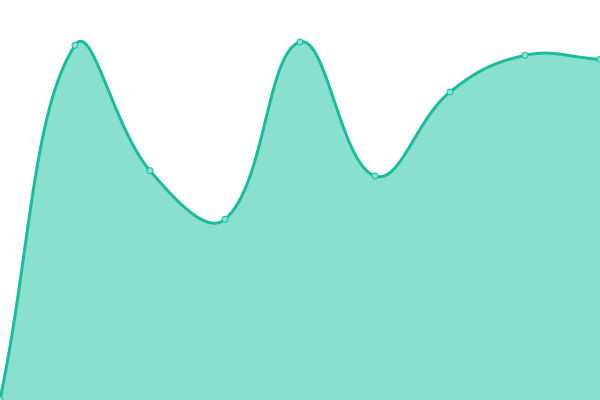 428ms
     
 | 

<a href="https://RedGeckoAgency.github.io/multisite-uptime/history/claymont-health">98.25%</a>
    

|  [Concord Care](https://concord-care.net) | 🟥 Down | [concord-care.yml](https://github.com/RedGeckoAgency/multisite-uptime/commits/HEAD/history/concord-care.yml) | 

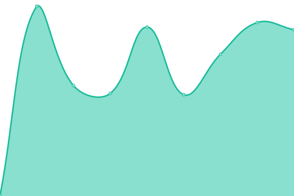 424ms
     
 | 

<a href="https://RedGeckoAgency.github.io/multisite-uptime/history/concord-care">98.28%</a>
    

|  [Concord Ridge](https://concord-ridge.net) | 🟥 Down | [concord-ridge.yml](https://github.com/RedGeckoAgency/multisite-uptime/commits/HEAD/history/concord-ridge.yml) | 

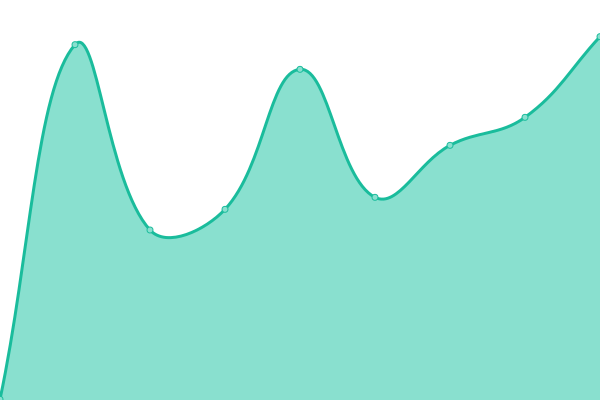 374ms
     
 | 

<a href="https://RedGeckoAgency.github.io/multisite-uptime/history/concord-ridge">98.30%</a>
    

|  [Crocker Pointe](https://crocker-pointe.net) | 🟥 Down | [crocker-pointe.yml](https://github.com/RedGeckoAgency/multisite-uptime/commits/HEAD/history/crocker-pointe.yml) | 

 408ms
     
 | 

<a href="https://RedGeckoAgency.github.io/multisite-uptime/history/crocker-pointe">98.33%</a>
    

|  [Cumberland Pointe](https://cumberland-pointe.net) | 🟥 Down | [cumberland-pointe.yml](https://github.com/RedGeckoAgency/multisite-uptime/commits/HEAD/history/cumberland-pointe.yml) | 

 459ms
     
 | 

<a href="https://RedGeckoAgency.github.io/multisite-uptime/history/cumberland-pointe">98.35%</a>
    

|  [Emerald Pointe](https://emerald-pointe.net) | 🟥 Down | [emerald-pointe.yml](https://github.com/RedGeckoAgency/multisite-uptime/commits/HEAD/history/emerald-pointe.yml) | 

 421ms
     
 | 

<a href="https://RedGeckoAgency.github.io/multisite-uptime/history/emerald-pointe">98.38%</a>
    

|  [Florentine Gardens](https://florentine-gardens.net) | 🟥 Down | [florentine-gardens.yml](https://github.com/RedGeckoAgency/multisite-uptime/commits/HEAD/history/florentine-gardens.yml) | 

 444ms
     
 | 

<a href="https://RedGeckoAgency.github.io/multisite-uptime/history/florentine-gardens">98.41%</a>
    

|  [Gardens Fairfax](https://gardens-fairfax.net) | 🟥 Down | [gardens-fairfax.yml](https://github.com/RedGeckoAgency/multisite-uptime/commits/HEAD/history/gardens-fairfax.yml) | 

 465ms
     
 | 

<a href="https://RedGeckoAgency.github.io/multisite-uptime/history/gardens-fairfax">98.43%</a>
    

|  [Heritageofhudson](https://heritageofhudson.net) | 🟩 Up | [heritageofhudson.yml](https://github.com/RedGeckoAgency/multisite-uptime/commits/HEAD/history/heritageofhudson.yml) | 

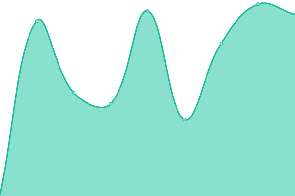 424ms
     
 | 

<a href="https://RedGeckoAgency.github.io/multisite-uptime/history/heritageofhudson">98.60%</a>
    

|  [Hickory Care](https://hickory-care.net) | 🟥 Down | [hickory-care.yml](https://github.com/RedGeckoAgency/multisite-uptime/commits/HEAD/history/hickory-care.yml) | 

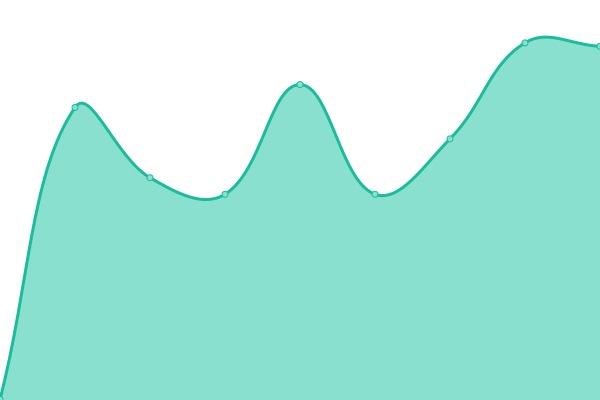 460ms
     
 | 

<a href="https://RedGeckoAgency.github.io/multisite-uptime/history/hickory-care">98.49%</a>
    

|  [Hickory Creek](https://hickory-creek.net) | 🟥 Down | [hickory-creek.yml](https://github.com/RedGeckoAgency/multisite-uptime/commits/HEAD/history/hickory-creek.yml) | 

 589ms
     
 | 

<a href="https://RedGeckoAgency.github.io/multisite-uptime/history/hickory-creek">98.66%</a>
    

|  [Huntington Woods](https://huntington-woods.net) | 🟥 Down | [huntington-woods.yml](https://github.com/RedGeckoAgency/multisite-uptime/commits/HEAD/history/huntington-woods.yml) | 

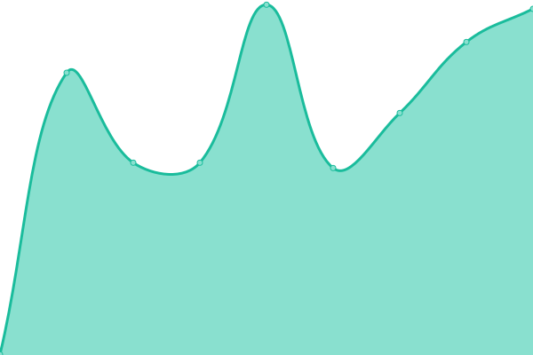 429ms
     
 | 

<a href="https://RedGeckoAgency.github.io/multisite-uptime/history/huntington-woods">98.68%</a>
    

|  [Jefferson Healthcare](https://jefferson-healthcare.net) | 🟥 Down | [jefferson-healthcare.yml](https://github.com/RedGeckoAgency/multisite-uptime/commits/HEAD/history/jefferson-healthcare.yml) | 

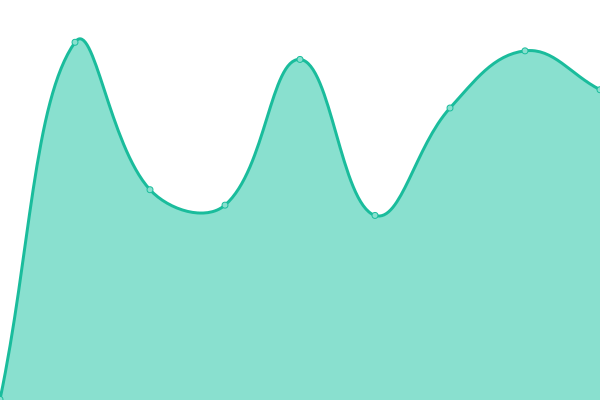 449ms
     
 | 

<a href="https://RedGeckoAgency.github.io/multisite-uptime/history/jefferson-healthcare">98.70%</a>
    

|  [Keystone Pointe](https://keystone-pointe.net) | 🟥 Down | [keystone-pointe.yml](https://github.com/RedGeckoAgency/multisite-uptime/commits/HEAD/history/keystone-pointe.yml) | 

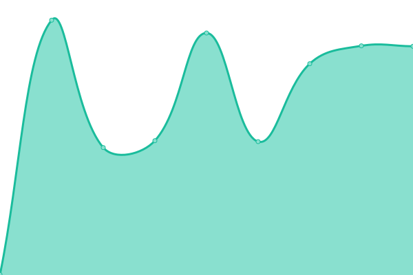 415ms
     
 | 

<a href="https://RedGeckoAgency.github.io/multisite-uptime/history/keystone-pointe">98.72%</a>
    

|  [Lafayette Care](https://lafayette-care.net) | 🟥 Down | [lafayette-care.yml](https://github.com/RedGeckoAgency/multisite-uptime/commits/HEAD/history/lafayette-care.yml) | 

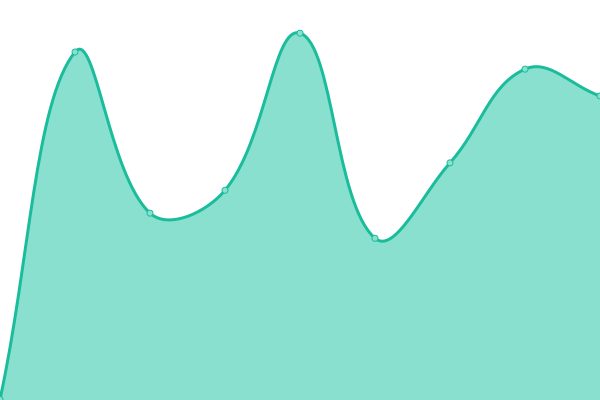 433ms
     
 | 

<a href="https://RedGeckoAgency.github.io/multisite-uptime/history/lafayette-care">98.74%</a>
    

|  [Mentor Ridge](https://mentor-ridge.net) | 🟥 Down | [mentor-ridge.yml](https://github.com/RedGeckoAgency/multisite-uptime/commits/HEAD/history/mentor-ridge.yml) | 

 454ms
     
 | 

<a href="https://RedGeckoAgency.github.io/multisite-uptime/history/mentor-ridge">98.77%</a>
    

|  [Millcreek Care](https://millcreek-care.net) | 🟥 Down | [millcreek-care.yml](https://github.com/RedGeckoAgency/multisite-uptime/commits/HEAD/history/millcreek-care.yml) | 

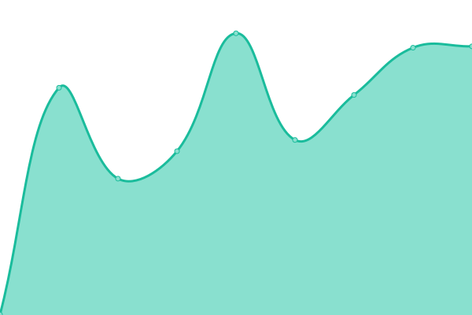 482ms
     
 | 

<a href="https://RedGeckoAgency.github.io/multisite-uptime/history/millcreek-care">98.79%</a>
    

|  [Huntington Court](https://huntington-court.net) | 🟥 Down | [huntington-court.yml](https://github.com/RedGeckoAgency/multisite-uptime/commits/HEAD/history/huntington-court.yml) | 

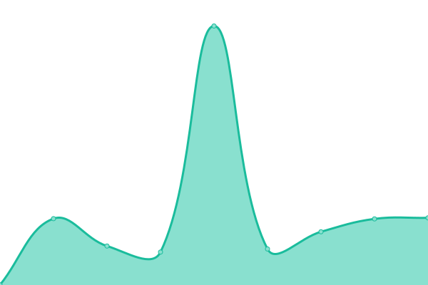 403ms
     
 | 

<a href="https://RedGeckoAgency.github.io/multisite-uptime/history/huntington-court">98.81%</a>
    

|  [Oak Pointe](https://oak-pointe.net) | 🟥 Down | [oak-pointe.yml](https://github.com/RedGeckoAgency/multisite-uptime/commits/HEAD/history/oak-pointe.yml) | 

 402ms
     
 | 

<a href="https://RedGeckoAgency.github.io/multisite-uptime/history/oak-pointe">98.83%</a>
    

|  [Park Health](https://park-health.net) | 🟥 Down | [park-health.yml](https://github.com/RedGeckoAgency/multisite-uptime/commits/HEAD/history/park-health.yml) | 

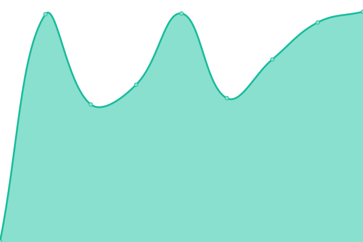 511ms
     
 | 

<a href="https://RedGeckoAgency.github.io/multisite-uptime/history/park-health">98.85%</a>
    

|  [Pinegrove Care](https://pinegrove-care.net) | 🟥 Down | [pinegrove-care.yml](https://github.com/RedGeckoAgency/multisite-uptime/commits/HEAD/history/pinegrove-care.yml) | 

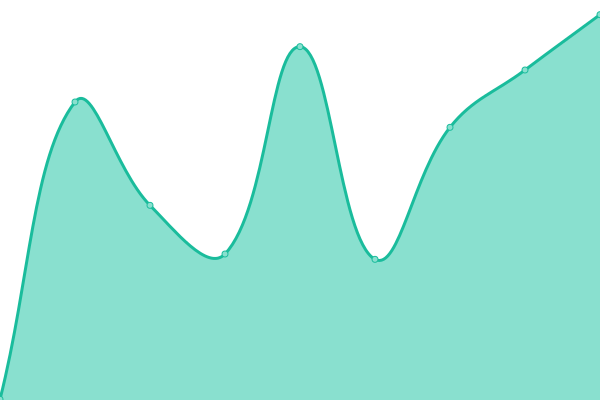 379ms
     
 | 

<a href="https://RedGeckoAgency.github.io/multisite-uptime/history/pinegrove-care">98.87%</a>
    

|  [Riverview Pointe](https://riverview-pointe.net) | 🟥 Down | [riverview-pointe.yml](https://github.com/RedGeckoAgency/multisite-uptime/commits/HEAD/history/riverview-pointe.yml) | 

 595ms
     
 | 

<a href="https://RedGeckoAgency.github.io/multisite-uptime/history/riverview-pointe">99.04%</a>
    

|  [Rockland Ridge](https://rockland-ridge.net) | 🟥 Down | [rockland-ridge.yml](https://github.com/RedGeckoAgency/multisite-uptime/commits/HEAD/history/rockland-ridge.yml) | 

 616ms
     
 | 

<a href="https://RedGeckoAgency.github.io/multisite-uptime/history/rockland-ridge">99.06%</a>
    

|  [Salem Woods](https://salem-woods.net) | 🟥 Down | [salem-woods.yml](https://github.com/RedGeckoAgency/multisite-uptime/commits/HEAD/history/salem-woods.yml) | 

 461ms
     
 | 

<a href="https://RedGeckoAgency.github.io/multisite-uptime/history/salem-woods">99.08%</a>
    

|  [Saybrook Landing](https://saybrook-landing.net) | 🟥 Down | [saybrook-landing.yml](https://github.com/RedGeckoAgency/multisite-uptime/commits/HEAD/history/saybrook-landing.yml) | 

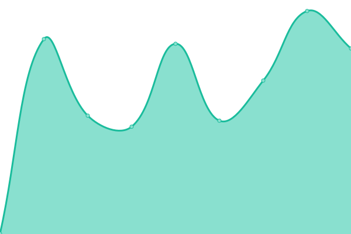 483ms
     
 | 

<a href="https://RedGeckoAgency.github.io/multisite-uptime/history/saybrook-landing">99.09%</a>
    

|  [Scenic Pointe](https://scenic-pointe.net) | 🟥 Down | [scenic-pointe.yml](https://github.com/RedGeckoAgency/multisite-uptime/commits/HEAD/history/scenic-pointe.yml) | 

 610ms
     
 | 

<a href="https://RedGeckoAgency.github.io/multisite-uptime/history/scenic-pointe">99.11%</a>
    

|  [Siena Gardens](https://siena-gardens.net) | 🟥 Down | [siena-gardens.yml](https://github.com/RedGeckoAgency/multisite-uptime/commits/HEAD/history/siena-gardens.yml) | 

 450ms
     
 | 

<a href="https://RedGeckoAgency.github.io/multisite-uptime/history/siena-gardens">99.13%</a>
    

|  [French Creek](https://french-creek.net) | 🟥 Down | [french-creek.yml](https://github.com/RedGeckoAgency/multisite-uptime/commits/HEAD/history/french-creek.yml) | 

 409ms
     
 | 

<a href="https://RedGeckoAgency.github.io/multisite-uptime/history/french-creek">99.14%</a>
    

|  [Sycamore Run](https://sycamore-run.net) | 🟥 Down | [sycamore-run.yml](https://github.com/RedGeckoAgency/multisite-uptime/commits/HEAD/history/sycamore-run.yml) | 

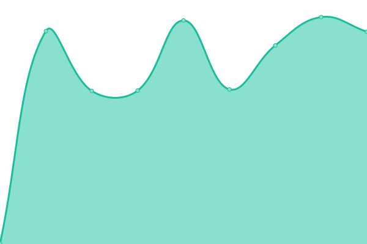 599ms
     
 | 

<a href="https://RedGeckoAgency.github.io/multisite-uptime/history/sycamore-run">99.16%</a>
    

|  [Tamarack Ridge](https://tamarack-ridge.net) | 🟥 Down | [tamarack-ridge.yml](https://github.com/RedGeckoAgency/multisite-uptime/commits/HEAD/history/tamarack-ridge.yml) | 

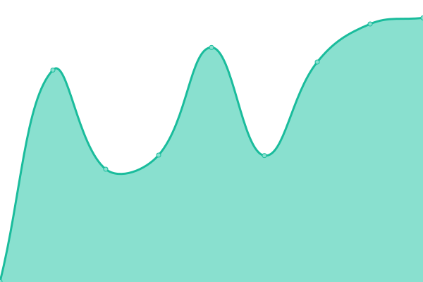 411ms
     
 | 

<a href="https://RedGeckoAgency.github.io/multisite-uptime/history/tamarack-ridge">99.18%</a>
    

|  [The Preserve](https://the-preserve.net) | 🟥 Down | [the-preserve.yml](https://github.com/RedGeckoAgency/multisite-uptime/commits/HEAD/history/the-preserve.yml) | 

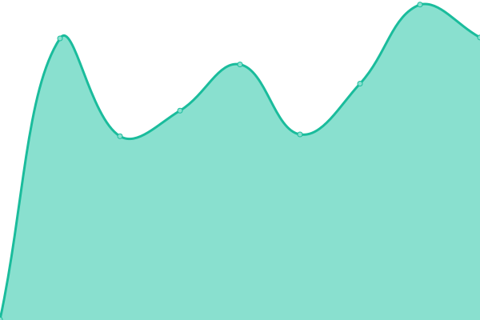 1026ms
     
 | 

<a href="https://RedGeckoAgency.github.io/multisite-uptime/history/the-preserve">99.19%</a>
    

|  [Timberland Ridge](https://timberland-ridge.net) | 🟥 Down | [timberland-ridge.yml](https://github.com/RedGeckoAgency/multisite-uptime/commits/HEAD/history/timberland-ridge.yml) | 

 381ms
     
 | 

<a href="https://RedGeckoAgency.github.io/multisite-uptime/history/timberland-ridge">99.21%</a>
    

|  [Venetian Gardens](https://venetian-gardens.net) | 🟥 Down | [venetian-gardens.yml](https://github.com/RedGeckoAgency/multisite-uptime/commits/HEAD/history/venetian-gardens.yml) | 

 563ms
     
 | 

<a href="https://RedGeckoAgency.github.io/multisite-uptime/history/venetian-gardens">99.23%</a>
    

|  [Waterview Pointe](https://waterview-pointe.net) | 🟥 Down | [waterview-pointe.yml](https://github.com/RedGeckoAgency/multisite-uptime/commits/HEAD/history/waterview-pointe.yml) | 

 570ms
     
 | 

<a href="https://RedGeckoAgency.github.io/multisite-uptime/history/waterview-pointe">99.24%</a>
    

|  [3.13.23.211.nip.io](https://3.13.23.211.nip.io) | 🟩 Up | [3-13-23-211-nip-io.yml](https://github.com/RedGeckoAgency/multisite-uptime/commits/HEAD/history/3-13-23-211-nip-io.yml) | 

 735ms
     
 | 

<a href="https://RedGeckoAgency.github.io/multisite-uptime/history/3-13-23-211-nip-io">100.00%</a>
    

<!--end: status pages-->

[**Visit our status website →**](https://RedGeckoAgency.github.io/multisite-uptime)

## 📄 License

- Powered by: [Upptime](https://github.com/upptime/upptime)
- Code: [MIT](./LICENSE) © [Anand Chowdhary](https://anandchowdhary.com), supported by [Pabio](https://pabio.com)
- Data in the `./history` directory: [Open Database License](https://opendatacommons.org/licenses/odbl/1-0/)
